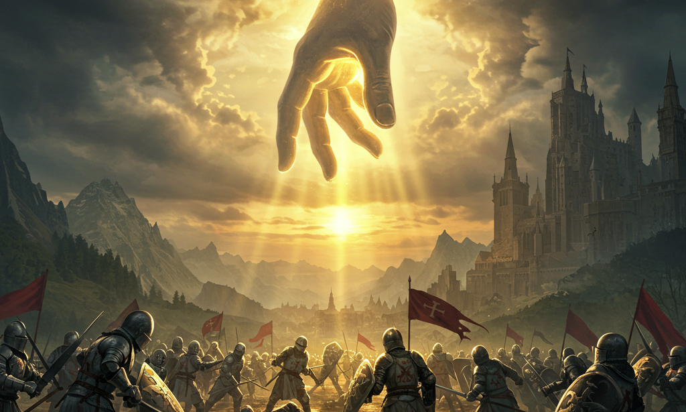
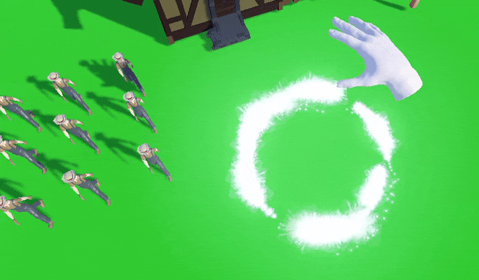

Ever dreamed of wielding the power of a god, not just as a commander, but as a physical presence on the battlefield? What if you could sculpt the very earth your armies fight on, or pluck your soldiers from danger with your own divine hand?

Welcome to the development journey of **Grey** – an ambitious god simulation RTS that puts you in the role of a divine hand, shaping worlds and commanding civilizations with the power of the gods themselves.

## What is Grey?

Grey is where the strategic depth of classic RTS games meets the awe-inspiring mechanics of god simulation. Imagine commanding your armies not through traditional point-and-click interfaces, but as a literal divine presence – picking up units with your ethereal hand, sculpting the landscape, and directly intervening in the fate of your civilization.

Inspired by legendary titles like *Black & White* and *Battle for Middle-earth*, Grey brings a fresh perspective to both genres by making you the divine force that shapes the battlefield.

## The Divine Hand Experience

At the heart of Grey lies our revolutionary Divine Hand System – a physics-based interaction model that makes you feel like a true deity:

-   **Physical World Manipulation:** Grab units, resources, and buildings with your divine hand.
-   **Intuitive Job Assignment:** Drop your workers directly onto buildings to assign their roles.
-   **Dynamic Resource Management:** Physically move resources around your kingdom.
-   **Tactical Positioning:** Place your armies with godlike precision.

Every interaction is designed to make you feel the weight and responsibility of divine intervention.

## A Living, Breathing World

Our cutting-edge Unified Vegetation System creates landscapes that feel truly alive:

-   **Organic Grass Generation:** Millions of grass blades rendered with performance-optimized techniques.
-   **Agricultural Management:** Wheat fields that grow and flourish under your divine guidance.
-   **Building-Aware Ecosystems:** Vegetation that intelligently adapts around your structures.
-   **Dynamic Environment:** A world that responds to your every divine touch.

*[Image: Screenshot of the Unified Vegetation System showing lush landscapes]*

## Built with Modern Excellence

Grey is crafted using Godot 4.4 with C# .NET 8.0, ensuring:

-   **Rock-Solid Architecture:** EventBus-based systems for maintainable, scalable code.
-   **Performance Optimized:** Smooth 60+ FPS even with thousands of units and vegetation.
-   **Comprehensive Testing:** Robust unit test coverage ensuring quality and stability.
-   **Modular Design:** Clean separation of concerns for future expansion.

## The Development Philosophy

We believe in transparent, community-driven development. This blog will be your window into:

-   **Technical Deep Dives:** How we solve complex game development challenges.
-   **Design Decisions:** The reasoning behind our gameplay choices.
-   **Progress Updates:** Real-time development milestones and achievements.
-   **Community Feedback:** How your input shapes the game's evolution.

## What's Next?

We're currently in active development, with major systems already functional:

✅ **Divine Hand Physics System** - Core interaction mechanics complete

✅ **Unified Vegetation System** - Advanced terrain generation implemented

✅ **Job Assignment Framework** - Worker management systems operational

✅ **Resource Management** - Economic systems functional

🔄 **Combat Systems** - Currently in development

🔄 **Campaign Mode** - Story-driven progression planned

## Join the Divine Journey

We're building Grey not just for ourselves, but for a community of strategy game enthusiasts who crave depth, immersion, and meaningful choices.

[**Wishlist Grey on Steam**](https://store.steampowered.com/) to stay updated on our progress and be among the first to experience divine strategy gaming at its finest.

Follow our development and join the conversation:


---

**What are you most excited to see in a modern god-game? Let us know in the comments below!**

The Grey Development Team
*David & Paul*