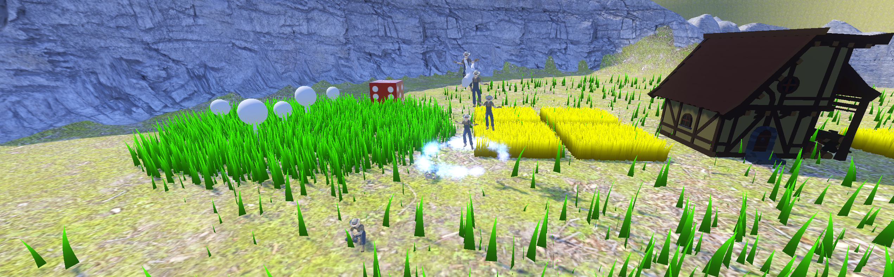

### The Magic We Lost

Remember the first time you played Black & White? That moment when you realized you could actually pick up your villagers, feel their weight in your divine hand, and place them exactly where they needed to be? Or the satisfaction of carefully positioning units in Battle for Middle-earth, watching your tactical decisions unfold with cinematic drama?

Modern strategy games have forgotten this magic. They've optimized for efficiency over wonder, trading immersion for mechanical button-pushing. 

**Grey exists to remember what they forgot.**

### Our Mission: Gameplay Over Graphics

We're not chasing photorealistic visuals or the latest trends. We're chasing that feeling - the moment when commanding a civilization feels like divine intervention rather than clicking through menus.

**What we believe:**
- **Substance over flash** - Great mechanics matter more than pretty screenshots
- **Intuitive over efficient** - If it feels natural, players will master it
- **Classic wisdom** - The best old games got fundamentals right that new games ignore

### What Grey Actually Is

Grey is a god-game RTS where you command through direct divine intervention. Instead of clicking and commanding, you reach into the world with your divine hand to:

- **Pick up and place units** exactly where they need to be
- **Assign jobs** by dropping workers directly onto buildings  
- **Manage resources** through physical manipulation
- **Shape the landscape** itself to support your civilization

Every interaction reinforces your role as a divine presence. When you grab a unit, you feel their weight. When you place them, they respond to your will immediately. No menus, no abstraction - just pure divine authority.

### A World That Responds

Our Unified Vegetation System creates environments that react to your divine touch:

- **Living grass** that bends as your units walk through it
- **Growing crops** that flourish under careful management
- **Dynamic ecosystems** that adapt around your buildings
- **Environmental storytelling** through the marks your civilization leaves

The world doesn't just look alive - it responds to every decision you make.

### Built on Solid Foundations

Grey uses Godot 4.4 with C# .NET 8.0 because we prioritize reliability over novelty:

- **Performance first** - Smooth 60+ FPS with thousands of units and dynamic vegetation
- **Maintainable architecture** - EventBus-based systems that scale cleanly
- **Thorough testing** - Because good mechanics require solid engineering
- **Modular design** - Easy to expand as Grey grows

We chose these tools not because they're trendy, but because they let us focus on gameplay instead of fighting the engine.

### Development Progress: Where We Stand

The core systems that make Grey feel divine are already working:

✅ **Divine Hand Physics** - Pick up, carry, and place units with satisfying weight and response

✅ **Unified Vegetation System** - Living environments that react to your civilization

✅ **Job Assignment Framework** - Intuitive worker management without menu diving

✅ **Resource Management** - Physical resource handling that feels natural

🔄 **Combat Systems** - Tactical warfare worthy of a divine commander

🔄 **Campaign Mode** - Story-driven progression that justifies your divine role

### Why We're Sharing This Journey

We believe in transparent development. This blog isn't marketing - it's documentation of our attempt to solve real problems in strategy gaming.

You'll see:
- **Technical challenges** and how we solve them
- **Design decisions** and the reasoning behind them  
- **Honest progress updates** - including what doesn't work
- **Community input** shaping Grey's evolution

### What This Means for Strategy Gaming

Grey isn't trying to revolutionize everything. We're taking the best ideas from classic god-games and RTS titles, then building them with modern technology and performance standards.

**The result?** Familiar mechanics that feel fresh because they're implemented properly. Divine intervention that feels weighty because it's physically grounded. Strategy that feels epic because every action reinforces your role as a god.

---

We're building Grey for strategy game enthusiasts who remember when commanding felt magical, not mechanical. If you miss the days when games prioritized wonder over efficiency, Grey is for you.

[**Wishlist Grey on Steam**](https://store.steampowered.com/) to follow our development and be among the first to experience what divine strategy gaming can be.

Follow our development journey:


*The Diener Brothers*